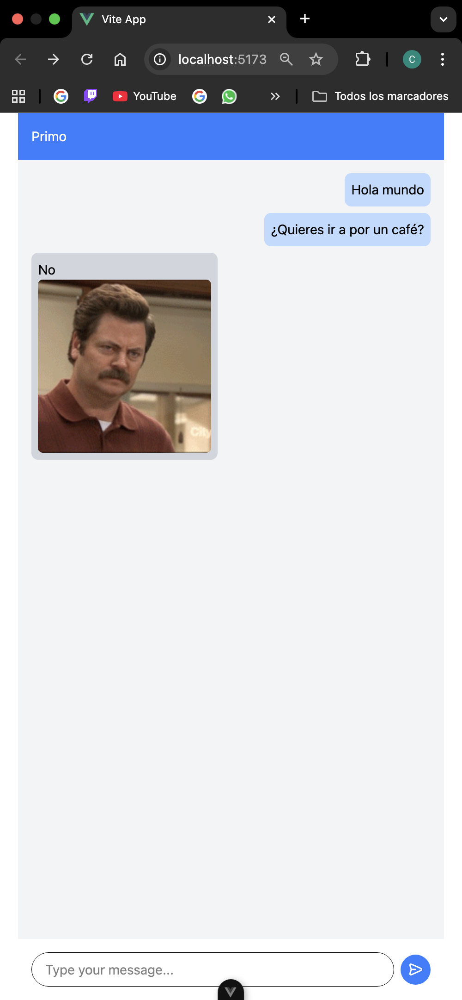

# 02 - Indecision App

Una pequeña aplicación de ejemplo creada con Vue 3 + TypeScript + Vite que simula un chat de "decisiones": si haces una pregunta (que termine con '?'), la app consulta la API pública https://yesno.wtf/api y responde con "yes"/"no" (y una imagen divertida).

## ¿Cuál es la idea?

El objetivo de este mini-proyecto es demostrar patrones comunes en aplicaciones modernas con Vue 3:

- Composición con composables (composable `useChat` para lógica del chat).
- Componentización (mensajes, burbujas y caja de texto).
- Integración con una API externa y manejo de estados reactivos.
- Uso de TypeScript y verificaciones de tipos con `vue-tsc`.

Es ideal como ejemplo didáctico para practicar Vue 3, Composition API y consumo de APIs.

## Características

- Interfaz tipo chat (envía mensajes desde la caja de texto).
- Si el mensaje termina en "?", la app espera un momento y pregunta a `yesno.wtf`.
- Muestra la respuesta y la imagen devuelta por la API.
- Código en TypeScript y estructura modular.

## Tech stack

- Vue 3
- TypeScript
- Vite
- TailwindCSS (estilos)

## Scripts útiles

Los comandos definidos en `package.json` son:

```bash
# instalar dependencias
npm install

# levantar servidor de desarrollo
npm run dev

# construir para producción
npm run build

# previsualizar el build localmente
npm run preview

# chequeo de tipos (vue-tsc)
npm run type-check

# lint y arreglar automáticamente
npm run lint

# formatear archivos de src
npm run format
```

Nota: el proyecto requiere Node >= 20.19.0 o >=22.12.0 según `package.json`.

## Estructura principal

Algunos archivos y carpetas relevantes:

- `src/views/IndecisionVue.vue` — Vista principal que compone el chat.
- `src/composables/useChat.ts` — Lógica para enviar mensajes y consultar `yesno.wtf`.
- `src/components/chat/ChatMessages.vue` — Lista de mensajes.
- `src/components/chat/MessageBox.vue` — Caja para escribir y enviar mensajes.
- `src/components/chat/ChatBubble.vue` — Burbujas individuales de mensaje.

## Cómo funciona internamente (breve)

1. El usuario escribe un mensaje en `MessageBox`.
2. `useChat.handleSendMessage` añade el mensaje al array reactivo `messages`.
3. Si el mensaje termina con `?`, se espera 1.5s y se llama a `https://yesno.wtf/api`.
4. La respuesta (texto + url de imagen) se añade a `messages` y se muestra en la UI.

---

## Ejemplo



Figura: Captura de ejemplo de la interfaz de la aplicación mostrando el chat y la respuesta de yesno.wtf.

---
